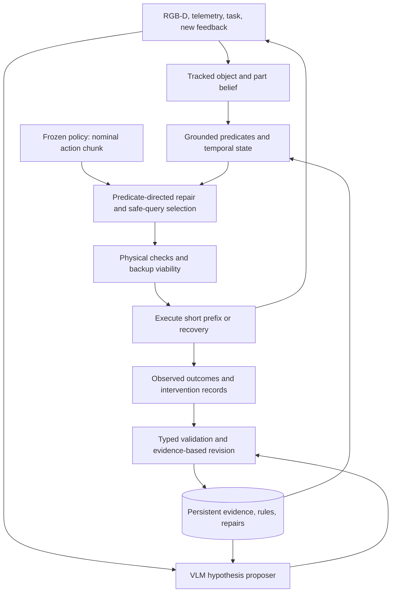

# Grounded Safety Memory and Predicate-Directed Policy Repair

## Recommendation

Build a policy-independent safety layer that learns **grounded, scoped safety rules from deployment evidence**, retains them across episodes, and uses them to choose and verify repairs to proposed actions. Use a VLM to propose interpretations and candidate predicates; use observations, measured consequences, and controlled interventions to decide which interpretations deserve to persist. Keep the base policy frozen in the initial study.

The proposed method is **Grounded Safety Memory (GSM)**, with **Predicate-Directed Chunk Repair (PDCR)** as the proposed steering algorithm. These are working names for an unimplemented research proposal, not established methods. The central research hypothesis is that *learning and querying safety concepts according to their effect on executable action repairs* will improve adaptation and transfer at a fixed feedback and compute budget.

The motivating behavior is concrete. After encountering “stay away from hot objects,” a robot should retain an object-independent rule, recognize relevant evidence on a different object, and constrain the appropriate interaction. It should also distinguish a cooled object, a verified insulated handle, and an unknown temperature. A persistent record saying “kettle = dangerous” would not demonstrate this capability.

The broad idea is already substantially occupied. RoboSafe combines executable safety logic and memory; JIT-Memory learns proactive mitigation from verified traces; CORE infers contextual rules for continuous safety filtering; LiSA studies conservative safety-memory adaptation; predicate invention and constrained policy steering each have extensive predecessors. The contribution must therefore be a specific learning-and-control mechanism, supported by matched experiments, rather than the assembly of these components.[^1][^2][^3][^4]

Start with a controlled MuJoCo proof of concept, then use the existing SafeManip/RoboCasa assets for richer temporal manipulation. Add a second simulator or embodiment only after the learning claim survives. The implementation roadmap is in [the companion proof-of-concept plan](../plans/2026-09-13-grounded-safety-memory-poc.md).

## Scope and evidence

This report covers literature available by September 13, 2026, including recent preprints. Publication status is specified where verified; an arXiv paper is not treated as an independently reproduced result. Numerical results across different papers are deliberately not ranked: observation privileges, policies, hazards, task distributions, and safety metrics differ.

“General purpose” should initially mean a common safety representation and runtime interface across multiple hazard families and policy architectures, with explicit sensor, dynamics, and controller adapters. It cannot mean guaranteed protection against arbitrary unobservable hazards or every possible embodiment. This broader framing is consistent with the recent research agenda in *Rethinking Safety for Generalist Robots*.[^5]

The recommendation assumes a publication-oriented, simulation-first project. It does not require the current FOL implementation, π0.5, or MuJoCo as permanent architectural commitments.

## What the repository actually provides

The inspected root checkout was `f67eaa14`. There are at least two relevant implementation tracks, which should not be conflated.

| Inspected component | What it establishes | Implication for the redesign |
|---|---|---|
| [`fol_safety_filter/primitives.py`](../../fol_safety_filter/primitives.py) | Fixed geometric predicates and cached semantic attributes; several getters convert missing values to `False`. | Replace binary missing-data handling with explicit unknown status and evidence provenance. |
| [`fol_safety_filter/rule_composer.py`](../../fol_safety_filter/rule_composer.py) | Explicit property-to-response branches, including hot exclusion, fragile slowdown, and spillable rotation restriction. | This is a useful baseline/compiler seed, not runtime rule induction. |
| [`fol_safety_filter/filter.py`](../../fol_safety_filter/filter.py) | `setup_episode()` clears the KB. `_apply_cbf()` explicitly performs direct geometric projection rather than a QP. There are visual maintenance and re-grounding paths. | The root implementation is not wholly static, but the inspected path lacks persistent learned safety memory. Do not infer a formal QP guarantee from README terminology. |
| [`fol_safety_filter/kb.py`](../../fol_safety_filter/kb.py) | Parses and evaluates grounded Boolean formulas; stores a `NovelPredicate` data structure. | A data structure for novel predicates does not itself establish that grounded predicates are learned online. |
| [π0.5 guidance worktree](../../.worktrees/flow-guidance-tier-gt/openpi_guided/src/openpi/models/pi0_guided.py) | At inspected worktree commit `b1fcc275`, implements in-denoising DCBF repair over predicted translations and explicitly credits constrained-flow prior work. | Reuse as a white-box steering baseline. It is distinct from root-level post-processing. |
| [`SafeManip/README.md`](../../SafeManip/README.md) and its monitor code | Existing RoboCasa integration, privileged-state export, and LTLf/DFA safety monitoring. | Strong evaluation infrastructure; privileged predicates must remain outside the deployment learner in perception-based experiments. |

These are source-inspection findings, not newly executed performance measurements. Existing submodule changes were present; this proposal does not modify them.

The [September 9 brainstorm](../superpowers/specs/2026-09-09-safety-memory-brainstorm.md) already proposes lifted rule memory and replay admission. Several claims need narrowing. JIT-Memory already evaluates sequential safety-memory improvement. LiSA already gates memory reuse by evidence. EvoPlan already mines constraints using counterfactuals. CEDAR already learns reusable formal specifications from counterexamples. None can be dismissed as merely “remembering text.”[^2][^4][^6][^7]

There are also two methodological corrections. Offline evaluation on a recorded trajectory is a diagnostic, not a rollout of the counterfactual controller. And an absence of harm after a shield intervention is not a label for the action that the shield prevented. Both distinctions matter for valid rule learning.

## Prior work and the remaining opening

### Runtime semantic safety and persistent memory

| Work | Established mechanism | Boundary relevant to this proposal |
|---|---|---|
| **RoboSafe**, Wang et al., 2025 preprint[^1] | Generates executable contextual/temporal safety predicates using long- and short-term memory; blocks actions or requests replanning. Its write-back checks include successful predicate execution. | The differentiator must be grounded learning and continuous repair, not executable rules plus retrieval. Executability alone does not verify a predicate's physical meaning. |
| **JIT-Memory**, Sima et al., 2026 preprint[^2] | Tracks safety-relevant state, retrieves factual rules, and evolves procedural mitigation through Test–Verify–Write. Reports sequential train/frozen-test evolution on IS-Bench. | Closest competitor for proactive safety memory. Compare learning new measurable predicates and continuous repairs against evolving mitigation procedures. “First learning curve for safety memory” is untenable. |
| **CORE**, Ravichandran et al., 2026 preprint[^3] | Infers contextual safety constraints from vision, grounds spatial safe sets, and applies CBF control with a perception-uncertainty analysis. | Its stated limitations include per-frame uncertainty and richer temporal environments. Its safe-initialization assumption matters when a newly inferred rule would classify the current state as unsafe. |
| **LiSA**, Kim et al., 2026 preprint[^4] | Induces broad and local safety policies from sparse feedback, with conflict handling and posterior-confidence gating. | Evidence-gated memory and exception refinement are inherited ideas. LiSA evaluates information/tool-agent safety, not robot dynamics and action chunks. |
| **Santos et al.**, 2024 preprint / subsequent robot experiments[^8] | Interprets language feedback with visual observations and updates an HJ-reachability safety controller online. | Online safety updates and policy-independent enforcement already exist. The remaining question is autonomous grounded induction and persistent transfer. |
| **RoboGuard**, Ravichandran et al., 2025–2026[^9] | Grounds predefined safety rules and reconciles plans with temporal specifications. | Formal plan repair is prior art; learnable sensing and low-level execution remain separate problems. |
| **Sethuraman et al.**, 2026[^10] | Maintains contextual rule memory and translates preferences into parameters of a multi-objective navigation policy. | Persistent rules steering continuous behavior are not new in isolation. Preference optimization also differs from hard hazard enforcement. |
| **ASIMOV**, Sermanet et al., 2025[^11] | Generates and amends robot constitutions and evaluates semantic safety judgments. | Automatic rule refinement is established. Judgment quality is not a closed-loop physical safety result. |
| **AGrail**, Luo et al., 2025[^12] | Adapts safety checks across agent tasks using a lifelong guardrail. | Include as broader agent-memory ancestry; it does not by itself address continuous robot control. |

### Predicate and specification learning

| Work | Established mechanism | Consequence for novelty |
|---|---|---|
| **InterPreT**, RSS 2024[^13] | Learns predicate programs from language feedback and operators from interactions, compiling a PDDL domain. | “LLM invents predicates at runtime” is already established. |
| **VisualPredicator**, ICLR 2025[^14] | Online invention of neuro-symbolic predicates and abstract world models. | A symbolic vocabulary that grows from visual experience is not sufficient novelty. |
| **UniPred**, 2025 preprint[^15] | Couples LLM hypotheses with neural predicate learning from low-level data and feedback. | Use its top-down/bottom-up distinction to avoid calling repeated prompting “learning.” |
| **SkillWrapper**, 2025–2026[^16] | Generative predicate invention with active data collection and a formal account of task-level abstractions. | Active validation and soundness language need careful comparison and explicit assumptions. |
| **Learning Temporal Logic Predicates**, Soroka et al., 2024–2025[^17] | Expression optimization plus conformal prediction for predicates describing trajectories. | Learned logic with finite-sample guarantees is prior art; online closed-loop reuse requires additional assumptions. |
| **EvoPlan**, July 2026 preprint[^6] | Mines a global mobility STL constraint offline using demonstration/counterfactual data, then uses it in planning and shielding. | Counterfactual rule mining feeding a safety shield is already occupied. Distinguish online contextual concept expansion and manipulation repair. |
| **CEDAR**, August 2026 preprint[^7] | Learns skill and specification automata with semantic judgments and execution counterexamples; reuses and composes them. | Learned reusable specifications and counterexample repair are established. The authors delimit their evidence to discrete, symbol-rich settings. |
| **Simulation to Rules**, ICLR 2026[^18] | A simulator VLM and generator VLM jointly refine formal visual-planning models. | Cross-checking two VLMs is useful, but agreement between them is not independent physical evidence. |
| **PanelShield**, August 2026 preprint[^19] | Manual-grounded plans, temporal/transition verification, and targeted counterexample repair. | Localized repair explanations and verify–repair loops are not themselves new. |

### Continuous steering and geometric grounding

| Work | Established mechanism | Role in evaluation |
|---|---|---|
| **Semantically Safe Robot Manipulation**, Brunke et al., 2024–2025[^20] | Semantic scene understanding converted into motion safeguards. | Early semantic-control baseline; do not frame VLM-to-CBF as new. |
| **VLSA/AEGIS**, IROS 2026[^21] | Plug-in CBF safety layer for VLAs; introduces SafeLIBERO. | Closest geometric-filter baseline for the existing stack. |
| **Your Model Already Knows**, June 2026 preprint[^22] | Uses VLA attention to identify the current target and tracking for dynamic obstacle filtering. | Dynamic target tracking is not the proposed contribution. |
| **PACS**, ICRA 2026[^23] | Path-consistent braking with reachability-based verification. | Essential baseline for preserving task behavior under intervention. |
| **DynaGuide**, 2025[^24] | Dynamics-based inference-time guidance of diffusion policies. | Dynamics-aware steering is already established. |
| **SafeFlow** and **SafeFlowMatcher**, 2025–2026[^25][^26] | Constrained generative planning using barrier functions; the latter separates prediction and correction. | Generic flow projection or post-generation correction cannot carry the novelty claim. |
| **Neuro-Symbolic Safety Guidance via Constrained Flow Matching**, July 2026[^27] | Corrects predicted VLA trajectories during denoising on SafeLIBERO. | Direct predecessor of the existing π0.5 steering mechanism. |
| **Retrieve-then-Steer**, May 2026[^28] | Reuses successful action chunks as a confidence-adaptive prior for a frozen generative VLA. | “Memory improves a frozen VLA at test time” is occupied. |
| **Language-Conditioned Latent Safety Filters**, July 2026[^29] | Language-conditioned HJ actor/critic, evaluated on unseen instances within constraint families. | Strong alternative to explicit rules; include if compatible code/data can be reproduced. |
| **ReKep**, 2024[^30] | VLM-generated relational keypoint constraints solved through optimization. | Grounding relations into geometric costs is reusable infrastructure. |
| **SafeVLA** and **SafeDojo**, 2025–2026[^31][^32] | Safety alignment through constrained learning; SafeDojo uses an interactive world model for safe RL. | Contrast training requirements. A frozen-policy method may still train predicate heads or local dynamics and must disclose that. |

### Defensible research positioning

The strongest candidate claim is:

> An online safety learner that retains competing grounded rule hypotheses, chooses evidence according to disagreement in the resulting continuous action repairs, and stores transferable predicates together with physically tested repair conditions for frozen policies.

The distinctive coupling is **rule uncertainty → repair disagreement → targeted evidence → revised rule → executable repair**. This is narrower than “continual contextual safety,” but more testable. It remains a novelty hypothesis, not a proven absence of all prior art. The strongest comparison is against a combination of JIT-Memory/LiSA-style learning and a strong existing steering backend, not against only an unfiltered policy.

Three contributions can support a paper if the experiments succeed: a control-relevant predicate-learning objective; a corresponding sparse chunk-repair and query algorithm; and a sequential evaluation protocol separating recurrence, transfer, exceptions, and genuinely new concepts. The protocol is useful even though sequential memory evaluation itself is not new.

### Architectural alternatives

| Direction | When it is attractive | Recommendation |
|---|---|---|
| Grounded rules + external repair | Sparse feedback, changing rules, frozen policies, explicit transfer and audit requirements | Preferred first study; the supported predicate/controller class must be explicit. |
| Language-conditioned learned safety actor/critic | A stable training distribution with enough diverse constraint data | Serious neural alternative, especially if symbolic grounding becomes the bottleneck; compare transfer and retraining cost.[^29] |
| Safety-aligned end-to-end policy | Repeated high-volume deployment with a relatively stable hazard distribution | Potential later distillation target; it makes rapid rule updates and causal attribution harder to isolate experimentally.[^31] |
| World-model candidate search | Hazards depend on future contact and object-state changes that a local model misses | Add after validating future-state fidelity; imagined safe outcomes need independent checks.[^32] |
| Planner-level mitigation memory | Hazards are best resolved by inserting a skill such as cleaning or switching off an appliance | Necessary for some tasks, and a strong baseline. Pair it with low-level checks when intermediate motion matters.[^2] |

The proposed hybrid is selected for the research question and available evidence, not because symbolic methods are inherently safer than neural ones. A learned critic may ultimately outperform the explicit rule representation; the oracle and fixed-memory experiments are designed to reveal that.

## Method: Grounded Safety Memory

### Problem formulation

At time \(t\), observe \(o_t\), robot telemetry \(s_t\), task \(g\), and a nominal action chunk \(U_t^\pi=(u_t,\ldots,u_{t+H-1})\). The true environment state and complete safety specification are unknown. Maintain belief \(b_t\), temporal monitor state \(z_t\), a small set of plausible safety hypotheses \(\mathcal H_t\), and persistent memory \(\mathcal M\).

The filter returns an executable prefix, an evidence-gathering action, a recovery behavior, or an explicit inability to certify a useful action. It also returns which rule, observation, and predicted violation caused the intervention. The goal is high safe task completion with low unnecessary intervention, feedback cost, and repeated failures.

Keep four quantities separate: whether a rule is normatively appropriate; whether its predicate is currently true; whether the relevant object is correctly localized; and whether the proposed controller can enforce it. A single VLM confidence score cannot substitute for these four questions.

### Representation: persistent rules, temporary facts

Use a typed, bounded relational-temporal language. Quantify over the currently tracked finite object set, with variables reusable across scenes. Permit geometric expressions, event/state predicates, guards, and a small temporal grammar. Do not permit arbitrary generated code in the actuator process.

Each **predicate definition** contains its argument types, observable inputs, executable evaluator, learned parameters, validity domain, calibration record, and missing-evidence behavior. It returns a truth value in `{true, false, unknown}`, optionally a calibrated interval or quantitative robustness. An RGB cue that merely suggests temperature must not be promoted to measured temperature.

Each **rule** stores an antecedent, prohibited interaction or obligation, time scope, object/part bindings, authority, exceptions, supporting and contradicting episodes, and applicable enforcement mechanisms. A rule may be locally usable after an explicit instruction while remaining provisional for broad autonomous reuse.

| Memory layer | Persists? | Example |
|---|---|---|
| Working belief and event history | Within an episode; selected events can be archived | Pot heating observed; current body temperature uncertain; gripper holds cup. |
| Episodic evidence | Across episodes | Observation/action/outcome windows, failed predictions, verified counterexamples, intervention traces. |
| Predicate and rule library | Across episodes | `HazardousContact(part, tool, context)` with evaluator, evidence, scope, and exceptions. |
| Repair library | Across episodes, scoped to capabilities | Keep a filled open cup upright; delay release until supported; re-route around a hot surface. |

“Global” initially means a persistent store for this deployment, not automatic fleet-wide synchronization. Separate general physical rules from household preferences, robot/tool limitations, and transient facts. On a second robot, transfer symbolic rules; rebind sensors and revalidate geometry, dynamics, and repair capabilities. Do not transfer numerical margins or classifier calibration by assumption.

Retrieval first selects plausible rules using semantics, then typed applicability checks bind them to the scene. Safety-critical installed rules require deterministic indexing by relevant entities/events; an embedding top-k miss must not silently deactivate a mandatory rule. Conflicting versions remain auditable. A provisional exception cannot override a higher-authority prohibition.

### What “learning during runtime” means

There are three distinct learning operations, with separate measurements:

1. **Rule acquisition:** translate new language, demonstrations, or consequence evidence into a candidate relation and scope. This may be in-context adaptation without changing model weights.
2. **Predicate grounding:** learn measurable thresholds, temporal state estimators, or small classifiers on frozen visual/object features. This changes an executable detector's behavior on unseen observations.
3. **Rule revision:** modify conditions, bindings, or supported exceptions when new evidence discriminates between hypotheses. This changes the deployed specification.

The VLM supplies hypotheses, not unquestionable labels. Evidence can include an authorized natural-language rule, sparse human corrections, physical telemetry, outcome events, and simulator interventions during training experiments. Log these sources separately. Autonomous consequence learning and instruction-based acquisition should be distinct experimental arms.

For a first implementation, search bounded programs containing up to three conditions over geometry, history, and learnable unary/binary predicates. Numeric thresholds are fitted within sensor/model validity limits; visual predicates use a small regularized head or prototype classifier on frozen features. Where a new concept needs an unavailable sensor or action capability, retain its symbolic definition with `unsupported` grounding/enforcement status.

For labeled evidence windows \((x_i,y_i)\), let \(V_{\phi,g_\theta}(x_i)\) predict whether the behavior violates candidate rule \(\phi\) using grounder \(g_\theta\). Fit candidates using

\[
L(\phi,\theta)=\sum_i w_i\,\ell(V_{\phi,g_\theta}(x_i),y_i)
+\lambda_c\operatorname{size}(\phi)
+\lambda_f L_{\text{false intervention}}.
\]

Weights encode evidence reliability and class imbalance. Evaluate generalization on held-out evidence, not on the same examples used to invent the predicate. Retain a small collection of statistically plausible candidates when sparse evidence cannot distinguish them. An empty collection signals misspecification or inconsistent evidence, not an invitation to silently discard the safety rule.

This is an executable learning recipe rather than a claim that arbitrary concepts can be learned from one event. VLM pretraining supplies strong prior knowledge. Demonstrating new runtime learning requires deployment-specific thresholds, randomized local conventions, changed physical states, and disjoint object instances that cannot be solved solely by recalling a familiar phrase.

### Learn from informative differences, not object names

For thermal contact, plausible hypotheses after one event might be “avoid this kettle,” “avoid metal,” “avoid heated surfaces,” or “avoid hot contact through a thermally unsuitable tool.” Select evidence that separates their behavioral consequences: a cooled metal object, a heated nonmetal object, a different contact part, or a supported protective tool.

Generate such variants in simulation or use safe observations. A camera reposition can resolve occlusion; a temperature channel or authorized response can resolve heat uncertainty. Touching a potentially hot object is not the default information-gathering experiment. If two hypotheses imply the same safe action now, resolving their wording is less urgent than an ambiguity that changes whether the robot may grasp or must wait.

The predicate proposal can split an overly broad concept: `Hot(object)` may become `Hot(part)` plus `ThermallySuitable(tool, part)`. This becomes meaningful predicate invention only if new evaluators distinguish held-out cases and the distinction changes control appropriately.

### Admission, correction, and censored evidence

A memory update passes four gates: valid typed execution; discrimination on positive and hard-negative evidence; compatibility with applicable rules and capabilities; and a paired closed-loop trial where counterfactual simulation is available. Compare a candidate rule against the previous memory on identical initial states and disturbances. Resimulate feedback-driven execution under each controller; do not simply score old actions under a new rule.

Keep near-misses, observed violations, and prevented actions as different record types. A small barrier margin is a model-dependent near-miss signal. A blocked command has an unobserved real outcome. Neither should automatically be counted as an independently confirmed hazardous event. In simulation, branch from a saved state to obtain a labeled counterfactual; on hardware, use uncertainty labels, safe replay approximations, or additional evidence.

One safe episode should not erase a rule, and repeated safe episodes under intervention should not falsely strengthen it. Retain counterexamples and replay tests when generalizing rules or adding exceptions. A provisional rule can trigger caution locally without becoming a universal permanent prohibition.

## Steering: Predicate-Directed Chunk Repair

### A common interface with multiple enforcement mechanisms

CBFs are one implementation of safety filtering, not a universal compilation target.[^33] Use the rule's semantics to choose enforcement:

| Rule meaning | Appropriate mechanism | Example correction |
|---|---|---|
| Geometric exclusion or speed bound | Robust CBF, reference governor, or short-horizon optimization | Brake or re-route around a hazardous part. |
| Orientation/transport constraint | Pose/velocity constrained trajectory repair | Keep a filled cup upright without deleting its transport motion. |
| Action precondition | Event guard plus continuous execution monitor | Prevent release until support is established. |
| Ordering or bounded obligation | Temporal monitor plus skill/replanning interface | Clean a contaminated gripper before touching ready-to-eat food. |
| Missing evidence | Safe sensing/query action | Inspect a handle or request temperature evidence. |
| Unsupported or infeasible requirement | Validated recovery/handoff | Return to a supported resting state, or report that no safe continuation is known. |

Never reinterpret “the task needs this object” as permission to weaken a physical constraint. Intended contact can be legitimate, but its safe contact conditions must be explicitly established. A contextually reasonable exception and a geometric corridor heuristic are not interchangeable.

### Proposed algorithm

For each plausible rule/grounding hypothesis, roll out the nominal chunk through a local predictive model and evaluate temporal monitors. Locate the earliest predicted violation and the predicates, objects, and action channels involved. This produces a diagnostic support set, not a claim of globally minimal causality.

Enumerate a bounded set of repair modes: path retiming, constrained translation, orientation correction, release delay, or insertion of an available recovery/sensing skill. Predicate-to-action dependencies prioritize modes; kinematics and dynamics determine whether they work. Preserve unrelated action components where feasible, but permit wider changes when coupling makes a narrow repair impossible.

Optimize each mode over physical action units:

\[
\min_{m,U}\quad
\lambda_m c(m)+\|U-U^\pi\|_W^2
+\lambda_s\|D(U-U^\pi)\|^2
-\lambda_g\widehat{\operatorname{progress}}(U)
\]

subject to actuator/kinematic constraints, an uncertainty-bounded rollout, all active hard specifications, and a terminal state admitting the designated backup behavior. Here \(c(m)\) penalizes the number and extent of repair operations; \(D\) discourages abrupt changes. Progress is only a ranking criterion among feasible candidates, never a substitute for a hard constraint. A practical solver enumerates a few modes and uses local continuous optimization; it need not solve a general mixed-integer problem globally.

For quantitative specifications, require lower-bound robustness

\[
\underline\rho_r(U)
=\min_{h\in\mathcal H_t,\,x\in\mathcal T(b_t,U)}
\rho(\operatorname{trace}(x,z_t),\phi_r^h)\ge0,
\]

where \(\mathcal T\) is a conservative prediction tube. Exact Boolean/automaton checks handle nonnumeric predicates. In an early prototype this check will be approximate; label it empirical screening until the prediction bounds, monitor semantics, and backup conditions are established.

Execute a short prefix and re-estimate. A hardware adapter must map normalized model output to actual controller commands, including reference frames, rotations, gripper conventions, latency, and mobile-base motion. A norm over unscaled heterogeneous action dimensions is not a meaningful minimal-intervention metric.

### Couple learning to the cost of repair

Let \(J^*_{\rm robust}(b,\mathcal H)\) be the best feasible repair cost under current hypotheses. For a safe evidence action \(q\), score

\[
\operatorname{VOI}(q)=J^*_{\rm robust}(b,\mathcal H)
-\mathbb E_y[J^*_{\rm robust}(b',\mathcal H'\mid q,y)]
-c_{\rm time}(q)-c_{\rm sensing}(q).
\]

Use this value-of-information approximation only over queries whose execution preserves the current safety envelope and temporal obligations. It prioritizes uncertainty that changes a feasible control decision. For example, resolving which of two visually similar cups is full matters when only one planned rotation creates a spill risk; uncertainty about a distant object's color may not matter.

This control-relevant query policy, combined with typed sparse repair, is the proposed algorithmic contribution. Generic information gain, model-predictive control, and minimum-deviation filtering are inherited techniques. The experiment must compare this coupling against entropy-based querying and generic chunk optimization with identical models, hypotheses, candidates, and budgets.

### Black-box and white-box policy support

The core path consumes action chunks and does not require policy gradients. For stochastic policies, request multiple native samples if the budget permits. Repeated calls to a deterministic head do not create diversity; generate explicitly labeled repair candidates through the controller instead.

For π0.5 or another accessible generative policy, optionally use predicate-derived costs during sampling. This is an acceleration/quality experiment, not the main novelty claim: existing constrained-flow methods and memory-prior steering already cover much of this space.[^27][^28] Always perform the same final physical check. Include a single-step policy adapter, recognizing that a horizon then requires model rollout or repeated policy evaluation.

## System design

Use three schedules. The actuator filter and lightweight monitors run every control tick. Tracking and short-horizon repair run at perception/chunk cadence. VLM proposal and memory consolidation run asynchronously on scene changes, unfamiliar predicates, contradictions, or explicit feedback. New objects trigger broad hazard discovery even when retrieval finds no familiar rule.

Every semantic result is tied to the observation timestamp, tracked identities, scene revision, and memory version that produced it. A stale result is not installed on a changed scene. Compile candidate rules away from the actuator process and atomically install an immutable snapshot only after validation. On timeout, continue only a prefix already justified under current evidence or enter the checked backup.

Implement initial persistence with a local transactional database plus append-only evidence files and a semantic index. A large distributed graph database is unnecessary for the proof of concept. Reproduce an episode using a pinned memory snapshot, policy version, perception model, threshold configuration, random seed, and action-adapter version.

A monitor keeps history for contamination, heating, and obligations. A new image does not automatically reset history. Conversely, persistent memory must not preserve yesterday's `Hot(kettle)` as today's fact. State aging and event transitions are distinct from forgetting a general rule.

## Worked example: a hot object

| Encounter | Evidence and learning | Appropriate behavior |
|---|---|---|
| First instruction: “Stay away from hot objects.” | Store the instruction and its scope; create a candidate relation between hot surfaces and proximity/contact. | Apply local caution; determine which objects/parts have relevant evidence. |
| Hot pan with visible heating history | Track identity and heat evidence; test whether current sensing supports a definite or uncertain state. | Avoid unsupported contact and route around the hazardous body. |
| New kettle in another kitchen | Bind the same relational rule to new parts; recompute grounding and geometry. | Reuse the rule without requiring the instruction again. |
| Identical kettle after cooling | New evidence changes the state, not the underlying rule. | Permit the task if other constraints hold; do not retain a permanent category ban. |
| Task requires moving the kettle | Candidate handle/tool exception needs explicit support and must respect the original instruction's scope. | Use a verified allowed interaction, wait, or request clarification; do not invent permission. |
| Temperature visually ambiguous | The detector returns unknown. | Obtain available evidence or use a safe alternative; never equate “looks ordinary” with “cold.” |

Temperature thresholds and damage mechanisms in the PoC are declared synthetic experimental parameters. No universal numerical heat/contact limit is assumed. Transfer of the rule is not proof that an RGB-only system can measure temperature.

## Evaluation and proof of concept

### Platform choice

| Platform | Best role | Main limitation |
|---|---|---|
| Existing MuJoCo/LIBERO setup with controlled contextual state | Fastest isolated learning-and-repair demonstration. | New thermal/contamination state models must be declared synthetic. SafeLIBERO alone mostly measures geometric safety.[^21] |
| **SafeManip + RoboCasa365** | Primary extended manipulation evaluation; existing workspace investment and temporal monitors. | Privileged monitor predicates cannot leak into perception-based learning; native policies must be competent on selected tasks.[^34][^35] |
| **ManiGuard** | Independent specification-based evaluation with physics-grounded monitors and distribution shifts. | Installation and usable policy performance must be measured before making it a critical dependency.[^36] |
| **OmniGibson/BEHAVIOR** | Follow-up thermal/stateful-object and simulator-transfer experiments. | Its documented temperature dynamics are simplified; sensor/physics fidelity and deployment cost need verification.[^37] |
| **ManiSkill3** | Alternative if high-throughput controlled manipulation becomes the priority. | Porting policies and hazard semantics creates additional work; speed alone does not validate the safety model.[^38] |

SafeLIBERO, LIBERO-Safety, SafeManip, and SafeVLA-Bench are distinct evaluation assets. SafeVLA-Bench is another useful task-aware post-hoc safety instrument, not evidence of online rule learning.[^39][^40]

### Minimal experiment that can falsify the proposal

Create three independently instrumented families: thermal contact/exclusion, open-container transport, and release-before-support. Use matched safe/unsafe scene pairs in which geometry is unchanged while state, history, or authorized context changes. Require at least two repair modalities, such as trajectory translation and release/orientation control.

Run a sequential curriculum: initial encounter, recurrence without repeating the instruction, transfer to unseen objects/layouts, exception/reversal, and simultaneous rules. Freeze memory during held-out transfer tests. Separately test the arrival of a genuinely new predicate; do not confuse recombination of known concepts with acquisition of a new one.

The first practical experiment should answer whether memory changes the second encounter appropriately, whether learned predicates survive matched counterexamples, and whether the repaired policy still completes the task. It should not begin with a large ungrounded world model or an unrestricted rule language.

### Baselines and isolation

The minimum board is: unfiltered policy; existing geometric filter; stateless VLM rules with the same compiler; episodic retrieval with the same observations; structured rule memory with ordinary chunk optimization; full GSM+PDCR; and oracle rules/grounding as diagnostic ceilings. Add JIT-Memory/RoboSafe-style adaptations and LiSA-style admission as strong memory baselines, explicitly labeling adaptations rather than claiming exact reproduction.

Run a second, fixed-memory steering board: reactive filter, PACS-style braking, generic chunk optimization, PDCR without query coupling, and full PDCR. On an accessible flow policy, include the existing in-denoising method. Equalize candidate count, model access, rollout horizon, feedback budget, and wall-clock budget. Report solver work as well as policy/VLM calls.

Critical ablations remove predicate learning, variables, counterexamples, scoped memory, active querying, and repair-mode selection one at a time. A binary success improvement alone cannot tell whether the benefit came from more conservative avoidance, better perception, extra compute, or actual learning.

### Metrics and statistical unit

Report joint safe success, task success, violation frequency/severity/exposure, unnecessary intervention, recovery/deferral rate, and time to completion. Add recurrence error, transfer performance, predicate false-safe/false-unsafe rates, rule overgeneralization, memory size, query cost, latency percentiles, and stale-result rejection frequency.

Learning curves use independent **episode streams** as the statistical unit. Episodes sharing an evolving memory are dependent. Pair methods on initial conditions and exogenous disturbances; use stream-level resampling or hierarchical analysis. Validation chooses hyperparameters; the held-out test cannot become an admission set through repeated tuning.

Report pretraining exposure and seed rules. A frozen VLM may already know “hot things can burn.” Runtime learning is supported by improvements under withheld local rules, novel state transitions, new measured thresholds, and hard negatives, not by successful repetition of common knowledge alone.

The companion plan specifies staged rollout counts, deliverables, milestones, and go/no-go targets. Those targets are engineering/research decision criteria, not promised performance.

## Guarantees, limits, and failure handling

Separate three claims. A typed program can be checked for syntactic validity. A monitor can be correct for its formal specification. A controller can satisfy that specification under stated model, sensing, timing, and initialization assumptions. None of these alone proves that the learned specification covers the real hazard.

A conditional safety argument can use events for specification coverage, grounding validity, prediction validity, and enforcement validity. If unsafe execution implies at least one of their failures, the union bound gives

\[
P(\text{unsafe})\le\delta_{\rm coverage}+\delta_{\rm grounding}
+\delta_{\rm dynamics}+\delta_{\rm enforcement}.
\]

This is a bookkeeping decomposition, not a new theorem. Each bound must refer to the same specified horizon and deployment distribution. Unknown hazard coverage cannot be set to zero. A collection of per-step bounds is not automatically an episode bound.

For a fixed compiled rule set, robust CBF/MPC conditions may establish invariance or recursive feasibility within the modeled subset. For a mid-episode update, check membership in the new safe/viable set before claiming continued invariance. If the hazard is detected after entry, record late discovery and execute a justified recovery if available; do not relabel the episode safe.

Conformal prediction and calibrated help-seeking have relevant precedents, but a changing learner/controller alters its data distribution.[^17][^41] Initially freeze rules and grounders for calibration/evaluation blocks and report coverage under those conditions. Treat adaptive statistical monitoring as an alarm mechanism unless a theorem actually establishes control of the chosen violation quantity. An e-process detects evidence against a hypothesis; it does not by itself control the robot's violation rate.

For physical execution, stopping is not universally safe: holding a load, supporting an object, or meeting a shutdown deadline can require continued action. Every platform needs validated hold/retreat/place/release behavior and explicit limits on when it is applicable. An infeasible optimizer cannot quietly relax a hard hazard constraint.

Remaining research risks are substantial: partially unobservable state, correlated VLM errors, data-efficient predicate grounding, confounded consequence attribution, dynamics mismatch, and lack of usable safe alternatives in the base policy. The purpose of the staged plan is to isolate those risks before a broad generality claim.

## Proposed paper and decision criteria

A suitable working title is **Learning What to Constrain: Grounded Safety Memory for Runtime Policy Repair**. The claim should be lifelong, contextual safety adaptation for frozen robot policies within an explicit supported class.

Proceed with the learning claim only if scoped learned predicates improve disjoint transfer and exception handling over equally informed memory baselines. Proceed with a separate steering claim only if PDCR improves the safe-success/intervention frontier over matched generic optimization and path-consistent braking with the rule set held fixed. If only the first succeeds, retain standard steering and write a stronger, narrower paper. If neither succeeds, the benchmark and error decomposition may still be useful, but the proposed algorithm should not be presented as validated.

## Sources

The numbered entries below serve as linked source notes and the source inventory. Dates identify the work or inspected version, rather than asserting peer review. Primary papers, official proceedings, and project documentation are used for factual claims.

[^1]: Le Wang et al. [RoboSafe: Safeguarding Embodied Agents via Executable Safety Logic](https://arxiv.org/html/2512.21220v2). December 2025, v2. Sections 3–6: memory, executable logic, write-back, and intervention scope.
[^2]: Bingrui Sima et al. [Self-Evolving Just-In-Time Memory for Proactive Embodied Safety](https://arxiv.org/html/2607.16247v1). 2026 preprint. Sections 4–5 and appendix: factual/procedural memory, trace verification, and sequential evaluation. Repository identifier is July; the arXiv record reports an initial June 26 submission.
[^3]: Zachary Ravichandran et al. [Contextual Safety Reasoning and Grounding for Open-World Robots](https://arxiv.org/html/2602.19983v2). February 24, 2026. Sections IV and VI: architecture, assumptions, uncertainty, limitations.
[^4]: Minbeom Kim et al. [LiSA: Lifelong Safety Adaptation via Conservative Policy Induction](https://arxiv.org/html/2605.14454v1). May 2026. Structured rule memory, local refinement, evidence gating.
[^5]: Rohan Sinha et al. [Rethinking Safety for Generalist Robots](https://arxiv.org/abs/2609.06326). September 6, 2026. Research agenda and broader hazard scope.
[^6]: Bhavya Sai Nukapotula et al. [EvoPlan: Evolutionary Neuro-Symbolic Robot Planning with Spatio-Temporal Guarantees](https://arxiv.org/html/2607.06724v1). July 7, 2026. Sections 4.1–4.3: offline constraint mining, counterfactuals, shielding.
[^7]: Lekai Chen, Alvaro Velasquez, Ashutosh Trivedi. [CEDAR: Automata as Verifiable Interfaces for Language-Guided Embodied Action](https://arxiv.org/html/2608.27797v1). August 28, 2026. Learned automata, counterexamples, reuse, and stated limitations.
[^8]: Leonardo Santos et al. [Updating Robot Safety Representations Online from Natural Language Feedback](https://arxiv.org/abs/2409.14580). September 2024. Language/vision-driven online reachability update.
[^9]: Zachary Ravichandran et al. [Safety Guardrails for LLM-Enabled Robots](https://arxiv.org/abs/2503.07885). March 2025; revised March 2026. RoboGuard and temporal plan reconciliation.
[^10]: Tharun Sethuraman et al. [Interpreting Context-Aware Human Preferences for Multi-Objective Robot Navigation](https://arxiv.org/html/2603.17510v2). March 2026; revised May 12, 2026. Persistent rule memory and preference-conditioned control.
[^11]: Pierre Sermanet et al. [Generating Robot Constitutions & Benchmarks for Semantic Safety](https://arxiv.org/abs/2503.08663). March 11, 2025. ASIMOV and constitution amendment.
[^12]: Weidi Luo et al. [AGrail: A Lifelong Agent Guardrail with Effective and Adaptive Safety Detection](https://arxiv.org/abs/2502.11448). February 17, 2025. Adaptive agent safety checks.
[^13]: Muzhi Han et al. [InterPreT: Interactive Predicate Learning from Language Feedback for Generalizable Task Planning](https://interpret-robot.github.io/). RSS 2024. Predicate/operator learning and code links.
[^14]: Yichao Liang et al. [VisualPredicator: Learning Abstract World Models with Neuro-Symbolic Predicates for Robot Planning](https://proceedings.iclr.cc/paper_files/paper/2025/hash/975db59bfa6eba2175a410f6afcecd99-Abstract-Conference.html). ICLR 2025. Online predicate invention.
[^15]: Qianwei Wang et al. [Unifying Deep Predicate Invention with Pre-trained Foundation Models](https://arxiv.org/html/2512.17992v1). December 19, 2025. UniPred's data-grounded learning loop.
[^16]: Ziyi Yang et al. [SkillWrapper: Generative Predicate Invention for Task-level Robot Planning](https://arxiv.org/abs/2511.18203v7). November 2025; revised June 5, 2026. Active collection and formal abstractions.
[^17]: Emi Soroka, Rohan Sinha, Sanjay Lall. [Learning Temporal Logic Predicates from Data with Statistical Guarantees](https://arxiv.org/abs/2406.10449v3). June 2024; revised April 28, 2025. Expression optimization and conformal guarantees.
[^18]: Yilun Hao, Yongchao Chen, Chuchu Fan, Yang Zhang. [Simulation to Rules: A Dual-VLM Framework for Formal Visual Planning](https://proceedings.iclr.cc/paper_files/paper/2026/hash/53b43ba4d5e12174a34ab94f9485df76-Abstract-Conference.html). ICLR 2026. Formal model generation and simulated consistency.
[^19]: Guipeng Xin et al. [PanelShield: Verifiable Closed-Loop Safe Planning for Robotic Industrial Panel Operation](https://arxiv.org/abs/2608.28305). August 28, 2026. Temporal/transition verification and localized repair.
[^20]: Lukas Brunke et al. [Semantically Safe Robot Manipulation: From Semantic Scene Understanding to Motion Safeguards](https://arxiv.org/abs/2410.15185). October 2024; revised April 2025. Semantic motion safeguards.
[^21]: Songqiao Hu et al. [VLSA: Vision-Language-Action Models with Plug-and-Play Safety Constraint Layer](https://arxiv.org/abs/2512.11891v2). December 2025; revised July 2, 2026; IROS 2026 acceptance reported. AEGIS and SafeLIBERO.
[^22]: Seongbin Park et al. [Your Model Already Knows: Attention-Guided Safety Filter for Vision-Language-Action Models](https://arxiv.org/abs/2606.09749). June 8, 2026. Attention-based target extraction and dynamic tracking.
[^23]: Ralf Römer et al. [From Demonstrations to Safe Deployment: Path-Consistent Safety Filtering for Diffusion Policies](https://arxiv.org/abs/2511.06385v2). November 2025; revised March 2026; ICRA 2026. PACS.
[^24]: Maximilian Du, Shuran Song. [DynaGuide: Steering Diffusion Polices with Active Dynamic Guidance](https://arxiv.org/abs/2506.13922). June 2025. Dynamics-guided inference-time steering.
[^25]: Xiaobing Dai et al. [SafeFlow: Safe Robot Motion Planning with Flow Matching via Control Barrier Functions](https://arxiv.org/abs/2504.08661v3). April 2025; revised November 2025. Flow-matching barrier functions.
[^26]: Jeongyong Yang, Seunghwan Jang, SooJean Han. [SafeFlowMatcher: Safe and Fast Planning using Flow Matching with Control Barrier Functions](https://arxiv.org/abs/2509.24243v3). September 2025; revised February 2026; ICLR 2026. Prediction/correction and barrier certification.
[^27]: William English, Hao Zheng, Rickard Ewetz. [Neuro-Symbolic Safety Guidance for Vision-Language-Action Models via Constrained Flow Matching](https://arxiv.org/abs/2607.01378). July 1, 2026. Predictive collision correction inside denoising.
[^28]: Jianchao Zhao et al. [Retrieve-then-Steer: Online Success Memory for Test-Time Adaptation of Generative VLAs](https://arxiv.org/abs/2605.10094v2). May 12, 2026. Success memory and flow-sampler priors.
[^29]: Ihab Tabbara, Yuxuan Yang, Hussein Sibai. [Towards General Language-Conditioned Latent Safety Filters](https://arxiv.org/abs/2608.00315). July 31, 2026 submission. Language-conditioned HJ filtering and within-family transfer.
[^30]: Wenlong Huang et al. [ReKep: Spatio-Temporal Reasoning of Relational Keypoint Constraints for Robotic Manipulation](https://rekep-robot.github.io/). 2024. VLM-generated relational costs and optimization.
[^31]: Borong Zhang et al. [SafeVLA: Towards Safety Alignment of Vision-Language-Action Model via Constrained Learning](https://arxiv.org/abs/2503.03480). 2025; revised 2026. Constrained training and Safety-CHORES.
[^32]: Kai Tang et al. [SafeDojo: Safe Reinforcement Learning for VLA via Interactive World Model](https://arxiv.org/abs/2606.20698). June 15, 2026 preprint. Training-based contrast class.
[^33]: Kai-Chieh Hsu, Haimin Hu, Jaime Fernández Fisac. [The Safety Filter: A Unified View of Safety-Critical Control in Autonomous Systems](https://arxiv.org/abs/2309.05837). 2023 preprint / 2024 review. Safety-filter foundations.
[^34]: Chengyue Huang et al. [SafeManip: A Property-Driven Benchmark for Temporal Safety Evaluation in Robotic Manipulation](https://arxiv.org/html/2605.12386v2). May 2026; revised June 10, 2026. LTLf safety evaluation and RoboCasa tasks.
[^35]: Soroush Nasiriany, Sepehr Nasiriany, Abhiram Maddukuri, Yuke Zhu. [RoboCasa365: A Large-Scale Simulation Framework for Training and Benchmarking Generalist Robots](https://arxiv.org/abs/2603.04356); [official project](https://robocasa.ai/). ICLR 2026; March 4, 2026 preprint. Household manipulation benchmark and resources.
[^36]: Yiyan Peng et al. [MANIGUARD: A Benchmark and Data Suite for Specification-Grounded Safety Evaluation and Improvement of Robotic Manipulation](https://arxiv.org/abs/2608.17386). August 18, 2026. Locked scenarios and physics-grounded safety monitors.
[^37]: StanfordVL BEHAVIOR project. [Official object-state examples](https://github.com/StanfordVL/BEHAVIOR-1K/blob/main/docs/getting_started/examples.md). Documentation accessed September 2026. Temperature, heated-state, and fire examples.
[^38]: ManiSkill authors/project. [ManiSkill3: GPU Parallelized Robotics Simulation and Rendering for Generalizable Embodied AI](https://arxiv.org/abs/2410.00425); [official repository](https://github.com/haosulab/ManiSkill). 2024 onward. Alternative simulator infrastructure.
[^39]: Rongxu Cui et al. [LIBERO-Safety: A Comprehensive Benchmark for Physical and Semantic Safety in Vision-Language-Action Models](https://libero-safety.github.io/). 2026. Distinct safety benchmark and official resources.
[^40]: Jialiang Fan et al. [SafeVLA-Bench: A Benchmark for the Success-Safety Gap in Vision-Language-Action Models](https://safevla.org/). 2026. Task-aware post-hoc safety evaluation.
[^41]: Allen Z. Ren et al. [Robots That Ask For Help: Uncertainty Alignment for Large Language Model Planners](https://arxiv.org/abs/2307.01928). CoRL 2023. KnowNo and calibrated help-seeking.
